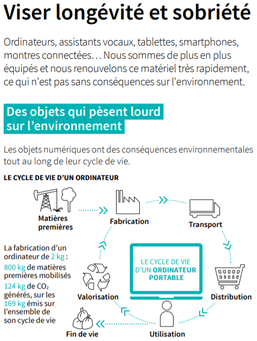

# Réduire son impact écologique : les bonnes pratiques du dev web
### Le constat 
La pollution liée au numérique est due pour moitié au fonctionnement d’internet, et pour l’autre moitié à la fabrication de nos terminaux numériques.

**En quelques chiffres** :
- Le numérique consomme 10 à 15 % de l’électricité mondiale, soit l’équivalent de 100 réacteurs nucléaires. Cette consommation double tous les 4 ans.
- Si Internet était un pays, il serait le 3ème plus gros consommateur d’électricité au monde avec 1500 TWH par an, derrière la Chine et les Etats-Unis.
- Un data center consomme en moyenne autant d’électricité que 30 000 habitants européens. Ainsi, les 182 centres de données présents sur le territoire français en 2016 concentrent 8% de la consommation électrique nationale.
- Internet pollue 1,5 fois plus que le transport aérien (émissions CO2).

Les émissions de gaz à effet de serre générées par le numérique se répartissent comme suit : 25% - data centers, 28% - infrastructures réseau, 47% - équipements des consommateurs.

Plus de 12 milliards de mails sont envoyés chaque heure dans le monde. L’envoi d’un mail avec une pièce jointe de 1 Mo dégage environ 19 grammes de CO2 et sa consommation électrique est équivalente à celle d’une ampoule pendant une heure.

Cela peut vous paraître encore relativement abstrait, mais rapporté à notre utilisation personnelle : 10 mails avec pièce jointe ou image envoyés par jour correspondent en émissions CO2 à environ :
- 1,6 km en voiture (118g/km).
- 10h d’éclairage avec une ampoule

Il suffit d’un email à destination d’une liste de diffusion. Cet exemple avec les emails est très parlant, mais il doit être aussi appliqué aux messages instantanés envoyés via Slack, Messenger, Whatsapp…

Chaque requête Google émet 7 grammes de CO2.

Le mauvais élève reste le streaming vidéo qui représente 60 % des flux de données sur internet. 1 heure passée sur Netflix produirait en moyenne 1,6kg de CO2, soit plus de 10km en voiture.

La responsabilité sur cette pollution du numérique et le manque de considération donnée est à porter à la fois par le système et par les utilisateurs qui l’entretiennent.
Sachant cela, comment faire en tant qu’utilisateur et plus particulièrement en tant que développeur web, pour réduire intelligemment son impact et continuer à vivre au mieux avec le poids de cette vérité ? (car j’ai du mal pour ma part, à considérer toute activité participant au développement d’internet, compatible avec une démarche écologique globale).

### En tant qu’utilisateur lambda
**Streaming**
- Diminuer l’usage du streaming vidéo dans l’absolu
- Réduire la résolution des vidéos en streaming pour réduire sa consommation de données
- Télécharger les contenus susceptibles d’être visionnés plusieurs fois
- Prêter ou échanger ses bibliothèques numériques (disque dur) et physiques (DVD…) et éviter de dupliquer des contenus

**Emails**
- Trier ses mails pour décharger les serveurs qui consomment pour les maintenir accessibles (même chose pour son cloud)
- Se désabonner des newsletters inutiles
- Minimiser les conversations mails à multiples destinataires

**Recherches internet**
- Enregistrer les sites visités régulièrement en favori pour éviter de multiplier les recherches
- Choisir un moteur de recherche responsable, qui compense ses émissions carbones (Lilo, Ecosia…)
- Questionner l’utilité de chaque recherche internet

**Matériel**
- Augmenter la longévité de son équipement : prendre soin de son ordinateur, privilégier les appareils modulaires pour faire évoluer sa configuration avec le temps, éviter l’overclocking qui réduit la durée de vie des processeurs, rester branché sur le secteur, désactiver l’indexation des fichiers et la défragmentation et activer TRIM sur SSD…
- Eviter de remplacer son ordinateur sur un coup de tête
- Acheter de l’occasion pour donner une seconde vie à des composants ou appareils
- Choisir un appareil adapté à son besoin
- Ne pas multiplier les matériels

*Source : https://www.ademe.fr/sites/default/files/assets/documents/guide-pratique-face-cachee-numerique.pdf*

### En tant que développeur
**Réduire le poids des pages**
- Ecrire efficacement et proprement (ex: les programmes gourmands en back induisent nécessairement une plus grande consommation de ressources et d’énergie)
- Stocker ou télécharger les images à la bonne échelle au lieu de compter uniquement sur CSS pour les redimensionner
- Compresser les médias qui peuvent l’être
- Ne pas hésiter à utiliser des CDN pour charger gratuitement des contenus existants sur d’autres sites (ex : banques d’images gratuites), et éviter de stocker inutilement sur un cloud des contenus déjà en ligne
- Eviter dans la mesure du possible les CMS proposant des thèmes lourds

**Choisir les bons hébergeurs**
- Eviter le cloud d’Amazon ainsi que les PaaS s’appuyant sur AWS (Heroku en fait partie, malheureusement…), et plus généralement tous les hosts dont les serveurs sont encore majoritairement alimentés par les énergies fossiles
- Dans la mesure du possible, choisissez des serveurs au plus proches géographiquement des visiteurs cibles de votre site web

**Emails**
- Faire du tri dans sa base de données et ainsi éviter de spammer des leads inactifs
- Privilégier la qualité et le ciblage de vos campagnes emailing à la quantité
- Renvoyer vers une page de votre site pour charger des médias plutôt que de les inclure directement dans un mail

Cette liste de bonnes pratiques est non exhaustive et inspirée de mon expérience personnelle, ainsi de ce que j’ai pu rassembler au cours de mes recherches. Je vous laisse volontairement aller à la pêche aux infos / solutions, cet article se voulant initiateur de la démarche.
Je pense que le sujet de la pollution numérique est vraiment unique. 
*Ou comment un écologiste convaincu qui regarde ou poste régulièrement des vidéos sur YouTube, prend position sur des forums et sensibilise ses proches par mail (par exemple) peut avoir dans l’absolu un impact environnemental plus important qu’une personne sans aucune sensibilité écologique, mais vivant simplement, et sans abuser d’internet.*

**Sources :**
- https://www.greenpeace.fr/la-pollution-numerique/
- https://www.ademe.fr/sites/default/files/assets/documents/guide-pratique-face-cachee-numerique.pdf
